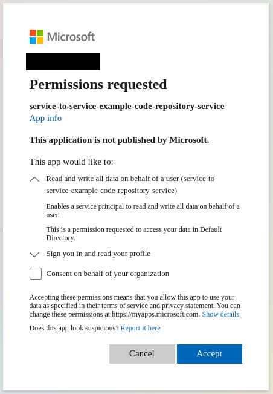
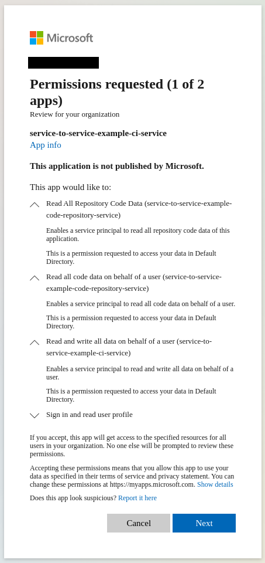
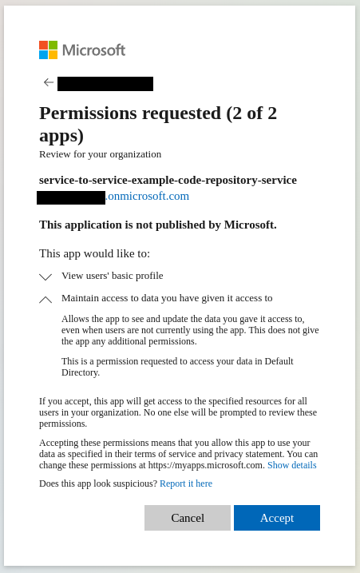

# Microsoft Entra ID service-to-service authentication playground

This repository provides a playground to experiment with service to service communication between custom services.

The repository contains two small REST API services, implemented in ASP.NET Core:

1. CodeRepositoryService
    * Provides APIs to manage pseudo code repositories
2. CiService
    * Provides APIs to create pseudo jobs for repositories, served by CodeRepository service
    * Communicates either with an app-token, acquired by `client_credentials` flow, or with an user-token, acquired by `on-behalf-of` flow

The repository can be used to demo four authentication flows:

1. [Authorization code flow using PKCE](https://learn.microsoft.com/en-us/entra/identity-platform/v2-oauth2-client-creds-grant-flow)
    * Using swagger-ui
2. [Client credentials flow](https://learn.microsoft.com/en-us/entra/identity-platform/v2-oauth2-client-creds-grant-flow)
    * Using terraform-generated `ci-service.client_credentials.for.code-repository-service.sh` script and swagger-ui
    * Alternatively implicitly by creating a CiService job, which uses the [.NET `Microsoft.Identity.Web.DownstreamApi` Library](https://learn.microsoft.com/en-us/entra/identity-platform/scenario-web-api-call-api-app-configuration?tabs=aspnetcore)
3. [On-behalf-of flow](https://learn.microsoft.com/en-us/entra/identity-platform/v2-oauth2-on-behalf-of-flow)
    * Using terraform-generated `ci-service.device-code.and.on-behalf-of.flow.for.code-repository-service.sh` script and swagger-ui
    * Alternatively implicitly using the [.NET `Microsoft.Identity.Web.DownstreamApi` Library](https://learn.microsoft.com/en-us/entra/identity-platform/scenario-web-api-call-api-app-configuration?tabs=aspnetcore)
4. [Device code flow](https://learn.microsoft.com/en-us/entra/identity-platform/v2-oauth2-device-code)
    * Using terraform-generated `ci-service.device-code.and.on-behalf-of.flow.for.code-repository-service.sh` script and swagger-ui

## Getting started

1. Install [Azure CLI](https://learn.microsoft.com/en-us/cli/azure/install-azure-cli#install), [Terraform](https://developer.hashicorp.com/terraform/install?product_intent=terraform), [Docker](https://docs.docker.com/engine/install/)
2. Login to Azure Tenant with Azure CLI: `az login --tenant "${YOUR_TENANT_ID}"`
    * Nothing bad will happen if you are signed in to a different tenant by accident. The follwing scripts will simply fail to execute.
3. Create a `config.sh` file, similar to the `config.example.sh`.
4. Execute `terraform_plan.sh` in the project root directory to inspect planned changes in the Azure tenant.
5. Execute `setup_and_start.sh` in the project root directory.
    * Provisions example App registrations via terraform in target Entra ID directory
    * Creates `appsettings.Compose.json` in `apps/CiService` and `apps/CodeRepositoryService` for docker-compose environment
    * Creates `appsettings.Development.json` in `apps/CiService` and `apps/CodeRepositoryService` for local debugging
    * Starts a swagger-ui on http://localhost:8080
    * Builds and starts CiService and CodeRepositoryService in docker-compose environment
    * Keeps running and prints logs of `swagger-ui`, `ci-service` and `code-repository-service`

## Example scenario

1. Open swagger-ui in browser on http://localhost:8080

### Create Code Repository

1. Select `CodeRepository` definition (should be the default)
2. Authorize for `code-repository-service` application
    1. Click `Authorize` button to open `Available authorizations` dialog
    2. Scroll to `UserAuthentication` form
    3. Select `{app-id}/.default` scope.
    4. Copy `{app-id}` into the `client_id` field
    5. Click `Authorize` on `Available authorizations` dialog
    6. Accept consent form for `code-repository-service` application
        * 
    7. Click `Close` on `Available authorizations` dialog
3. Create `test` repository
    1. Click `Try it out` on `POST /repositories`
    2. Enter `test` as `repositoryName`
    3. Click `Execute` button
4. Inspect logs of `code-repository-service-1` to see the Bearer token
    * Decode Bearer token. E.g. via https://jwt.io/
    * ```
      {
        "aud": "{CODE_REPOSITORY_CLIENT_ID}", // Audience: Client ID of the code repository server application. Other applications must not accept this token.
        "iss": "https://login.microsoftonline.com/{TENANT_ID}/v2.0", // Issuer: Authorization server which issued this token. Is trusted by the code repository server.
        "azp": "{CODE_REPOSITORY_CLIENT_ID}", // Authorized Party: Client ID of the code repository server application.
        "name": "{user_display_name}",
        "oid": "{user_principal_object_id_in_entra_id}",
        "preferred_username": "{preferred_username}",
        "scp": "UserImpersonation.ReadWrite.All", // Scopes: Token authorizes to perform read and write operations on behalf of the user. This scope is only valid for the specfic audience (in this case the code repository service)!
        "sub": "{application_scoped_user_id_string}",
        "tid": "{TENANT_ID}",
        [...]
      }
      ```
5. Create code resource via `PUT /repositories/{repositoryName}/code` endpoint for the `test` repository and with any content

### Create Job for test repository, authenticating to CodeRepositoryService via app token

1. Select `CiService` definition in swagger-ui
2. Authorize for `ci-service` application
    1. Click `Authorize` button to open `Available authorizations` dialog
    2. Scroll to `UserAuthentication` form
    3. Select `{app-id}/.default` scope.
    4. Copy `{app-id}` into the `client_id` field
    5. Click `Authorize` on `Available authorizations` dialog
    6. Accept consent form for `ci-service` application
        * 
        * 
    7. Click `Close` on `Available authorizations` dialog
3. Create job for `test` repository with any command and with `impersonateUser=false`
4. Inspect logs of `ci-service-1` to see the Bearer token
    * Decode Bearer token. E.g. via https://jwt.io/
    * ```
      {
        "aud": "{CI_SERVICE_CLIENT_ID}", // Audience: Client ID of the ci service application. Other applications must not accept this token.
        "iss": "https://login.microsoftonline.com/{TENANT_ID}/v2.0", // Issuer: Authorization server which issued this token. Is trusted by the ci service.
        "azp": "{CI_SERVICE_CLIENT_ID}", // Authorized Party: Client ID of the ci service application.
        "name": "{user_display_name}",
        "oid": "{user_principal_object_id_in_entra_id}",
        "preferred_username": "{preferred_username}",
        "scp": "UserImpersonation.ReadWrite.All", // Scopes: Token authorizes to perform read and write operations on behalf of the user. This scope is only valid for the specfic audience (in this case the ci service)!
        "sub": "{application_scoped_user_id_string}",
        "tid": "{TENANT_ID}",
      }
      ```
5. Inspect logs of `code-repository-service-1` to see the Bearer token
    * Decode Bearer token. E.g. via https://jwt.io/
    * ```
      {
        "aud": "{CODE_REPOSITORY_CLIENT_ID}",  // Audience: Client ID of the code repository server application. Other applications must not accept this token.
        "iss": "https://login.microsoftonline.com/{TENANT_ID}/v2.0",
        "azp": "{CI_SERVICE_CLIENT_ID}", // Authorized Party: Client ID of the ci service application.
        "oid": "{ci_service_principal_object_id_in_entra_id}",
        "roles": [
          "Repositories.Code.Read.All" // ci-service has the code-repsitory-service app role "Repositories.Code.Read.All" assigned. Therefore it is allowed to read the repository code of any user.
        ],
        "sub": "{ci_service_principal_object_id_in_entra_id}",
        "tid": "{TENANT_ID}",
        [...]
      }
      ```

### Create Job for test repository, authenticating to CodeRepositoryService on-behalf of the user via a user token

1. Create job for `test` repository with any command and with `impersonateUser=true`
2. Inspect logs of `ci-service-1` to see the Bearer token
   * Should be still the same user token like before 
3. Inspect logs of `code-repository-service-1` to see the Bearer token
    * Decode Bearer token. E.g. via https://jwt.io/
    * ```
      {
        "aud": "{CODE_REPOSITORY_CLIENT_ID}",  // Audience: Client ID of the code repository server application. Other applications must not accept this token.
        "iss": "https://login.microsoftonline.com/{TENANT_ID}/v2.0",
        "azp": "{CI_SERVICE_CLIENT_ID}",  // Authorized Party: Client ID of the ci service application.
        "name": "{user_display_name}",
        "oid": "{user_principal_object_id_in_entra_id}",
        "preferred_username": "{preferred_username}",
        "scp": "UserImpersonation.Repositories.Code.Read.All", // Scopes: Token authorizes to read repository code on behalf of the user. This scope is only valid for the specfic audience (in this case the code repository service)!
        "sub": "{application_scoped_user_id_string}",
        "tid": "{TENANT_ID}",
        [...]
      }
      ```
